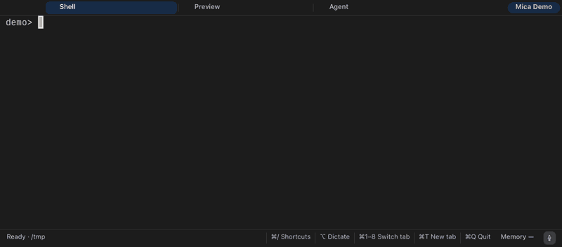

# Mica Terminal

**One native macOS workspace for project shells, coding agents, and the tools around them.**

Mica keeps each project in its own set of terminal tabs. Run Codex, Claude Code, Git tools, or a regular shell side by side, with live agent activity, project launchers, local voice dictation, and a shared focus timer.

> macOS 14 or later · Native AppKit · C PTY core · `libvterm`

## Get Mica

**[Project website](https://megasoft1978.github.io/mica-terminal/)** · **[Releases](https://github.com/megasoft1978/mica-terminal/releases)** · **[Source](https://github.com/megasoft1978/mica-terminal)**



[Watch or download the full-quality demo video](docs/assets/mica-demo.mp4) · The demo uses a disposable sample project; Claude Code is shown idle and no agent prompts are sent.

There isn’t a packaged release yet. To build Mica locally, install Xcode Command Line Tools and Homebrew, then run:

```sh
brew install libvterm pkg-config
git clone https://github.com/megasoft1978/mica-terminal.git
cd mica-terminal
make app
open build/Mica.app
```

A locally signed build (`make dist`) is ad-hoc signed, so on another Mac macOS may say it can’t be opened. Control-click the app and choose Open once.

The first dictation use downloads the local speech model (about 630 MB). Mica requests microphone access only when you start dictation.

## Why Mica

- **Stay with the project.** Give a project its own named tabs, folders, and ready-to-review startup commands.
- **Keep your terminal yours.** Mica runs ordinary interactive `zsh` sessions. Use Codex, Claude Code, `lazygit`, or any command; Mica doesn’t take over your shell configuration.
- **See what agents are doing.** Agent tabs show activity and when they need input. Scrollback, text selection, and normal terminal input stay close at hand.
- **Find the right project.** Project windows show a short project mark in the Dock and macOS app switcher icon; window titles keep the full project name.
- **Speak a command.** Hold left Option, dictate, then review or edit the inserted text before pressing Return. Recognition runs locally after the initial model download.
- **Keep dictation out of your way.** The live transcript and listening state appear in the bottom status strip, so they never cover terminal output or the cursor.
- **Find what scrolled by.** Search scrollback with `⌘F`, step through matches with `⌘G`, and reorder tabs by dragging them.
- **Open terminal links.** Command-click OSC 8 `http` and `https` links. Ordinary clicks still go to terminal apps that capture the mouse.
- **Know what it costs.** Three idle tabs use about 77 MiB of physical footprint, roughly on par with Terminal.app running Zellij (about 64 MiB); Mica is an integrated app, not a memory saver. [Details](docs/MEMORY-BASELINE.md)
- **Copy from remote sessions.** Programs over SSH or tmux can set your clipboard (OSC 52). Mica asks before the first copy in each tab and never lets a program read your clipboard.
- **Keep a little focus.** A shared focus timer follows you across Mica windows and can notify you when a focus or break period ends.

## A few shortcuts

| Action | Shortcut |
| --- | --- |
| Switch tabs | `⌘1`–`⌘8`, `⌘9` |
| New tab / close tab | `⌘T` / `⌘W` |
| Choose a tab / browse scrollback | `⌘⇧P` / `⌘⇧S` |
| Dictate | Hold left `⌥` |
| Open a terminal web link | `⌘`-click an OSC 8 link |
| New window | `⌘N` |
| Resize / reset terminal text | `⌘+` / `⌘−` / `⌘0` |
| Find in scrollback / next / previous | `⌘F` / `⌘G` / `⇧⌘G` |
| Clear scrollback | `⌘K` |
| Light / dark terminal theme | `⌥⌘L` |

### Create a project launcher

Run `make new-instance` to create a project launcher. Use **Project → Settings…** to edit its name and tabs. A `.mica` layout can also define named tabs, folders, and optional commands.

## Built with and credits

Mica’s terminal session core is C, its macOS interface uses AppKit, and terminal escape sequences are parsed by [libvterm](https://github.com/neovim/libvterm) (MIT). Local speech recognition uses [FluidAudio](https://github.com/FluidInference/FluidAudio) (Apache-2.0), Apple Core ML and AVFoundation, and [Parakeet Ultra by Moondream](https://huggingface.co/moondream/parakeet-ultra), based on NVIDIA Parakeet TDT 0.6B v3 and distributed as a Core ML conversion by FluidInference (CC BY 4.0). See [voice/THIRD_PARTY_NOTICES.md](voice/THIRD_PARTY_NOTICES.md) and [voice/ThirdPartyLicenses](voice/ThirdPartyLicenses/) for model and dependency notices. Mica does not yet include a root-level project license; source availability does not grant permission to redistribute the project.

## Build and contribute

```sh
make app       # build Mica.app and its local speech helper
make test      # run the PTY, UI, launcher, and fixture checks
make validate  # run tests, build, and check the app bundle
make dist      # ad-hoc sign (SIGN_ID="Developer ID Application: …" to override) and zip build/Mica.zip
```

Tests use local fixtures and never send prompts to agent CLIs. See [memory notes and a Zellij comparison](docs/MEMORY-BASELINE.md), [agent notifications](docs/AGENT-NOTIFICATIONS.md), and [all workflows](https://github.com/megasoft1978/mica-terminal/actions).
