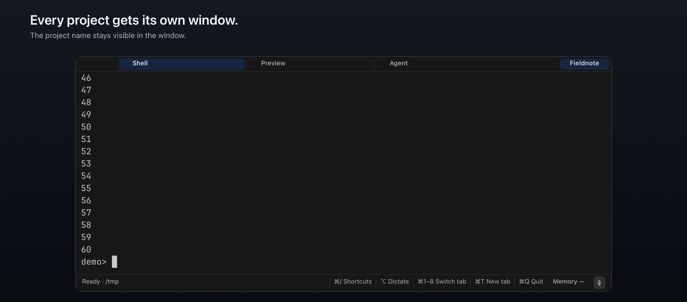

<p align="center">
  
</p>

<h1 align="center">Mica</h1>

<p align="center">
  <strong>Know exactly which project you’re in.</strong><br>
  Give every project a named window. See its name, then switch by name from one Dock icon. Terminal tabs, on-device dictation and a focus timer are built in.
</p>

<p align="center">
  <a href="https://github.com/megasoft1978/mica-terminal/releases/tag/v0.1.0-alpha.16"></a>
  
  <a href="LICENSE"></a>
</p>

<p align="center"><strong>Free · Apple silicon · macOS 14 or later · 10.6 MB download</strong></p>

<p align="center">
  <a href="https://megasoft1978.github.io/mica-terminal/">Website</a> ·
  <a href="https://github.com/megasoft1978/mica-terminal/releases/download/v0.1.0-alpha.16/Mica.zip"><strong>Download</strong></a> ·
  <a href="https://github.com/megasoft1978/mica-terminal/releases/tag/v0.1.0-alpha.16">Release notes</a> ·
  <a href="LICENSE">MIT license</a>
</p>

<p align="center">
  <picture>
    <source media="(prefers-color-scheme: light)" srcset="docs/assets/mica-light.png">
    
  </picture>
</p>
<p align="center"><sub>A real Mica window with fictional project and terminal content.</sub></p>

<p align="center">
  <a href="docs/assets/mica-demo.mp4"></a>
</p>
<p align="center"><a href="docs/assets/mica-demo.mp4"><strong>Watch the 18-second feature tour (MP4)</strong></a> · <a href="docs/assets/mica-demo.gif">Open the looping GIF (no pause control; use MP4 for reduced motion)</a> · <a href="docs/assets/project-switching-demo.mp4">Watch the focused project-switching demo</a></p>
<p align="center"><sub>The tour combines current Mica screens with illustrated Dock and timer menus. Project names, terminal output and SSH destinations are fictional; no microphone, coding agent or SSH connection is used.</sub></p>

## What Mica does

- **Keeps projects distinct.** Each project opens in its own window. The project name stays in the window title and top-right badge; hover over the badge to read the full name. Right-click Mica’s single Dock icon to switch between open project windows. The icon mark follows the front project, and each menu entry includes its active tab. Project windows share Mica’s main process.
- **Keeps terminal work together.** Use ordinary `zsh` tabs for Shell, Claude Code, Codex, `lazygit` or other programs. Mica’s activity detection is designed for Claude Code and Codex; screen-based detection is best-effort, and other programs are not guaranteed an agent status. Restored tabs normally start fresh. If enabled, Mica can resume Claude Code or Codex when a validated session ID is available; arbitrary processes and scrollback do not resume.
- **Organizes with tabs and project windows.** Mica does not have split panes yet.
- **Finds actions and text.** The Command Palette (<kbd>⌘⇧P</kbd>) searches menu actions and project tabs. Quick Select (<kbd>⌘⇧U</kbd>) labels visible URLs, existing file paths and Git hashes; type a label to copy, or hold <kbd>⌥</kbd> to open or reveal it. Prompt landmarks and last-command output are available with <kbd>⌘↑</kbd>/<kbd>⌘↓</kbd> and the Edit menu.
- **Dictates on your Mac.** Speak, review the transcript and edit it before pressing Return. Recognition uses Moondream’s Parakeet Ultra, based on NVIDIA Parakeet TDT 0.6B v3, converted to Core ML by FluidInference. Project vocabulary correction is local and can be undone to restore the raw transcript.
- **Adds a focus timer.** One timer is shared by every Mica window. Show its phase and countdown in the macOS menu bar, then start, pause, resume or end a phase from its menu or Mica’s Focus menu.
- **Connects through OpenSSH.** Save a host or `~/.ssh/config` alias and an optional remote folder. Mica opens a fresh interactive SSH tab using macOS OpenSSH and your existing keys, agent and host-key checks. It stores no SSH passwords or private keys.

## Memory snapshot

These are measured idle footprints for one window on the same Apple silicon Mac. The Mica measurement was made on **September 29, 2026**, before alpha 16; it is a dated baseline, not a measurement of the current release.

| App | What was measured | Idle memory |
| --- | --- | ---: |
| **Mica** (3 tabs) | terminal, dictation and focus timer | **about 55–60 MB** |
| Alacritty | terminal | 69 MB |
| kitty | terminal | 80 MB |
| iTerm2 | terminal | 126 MB |
| Wispr Flow | dictation | 645 MB |

The same-day iTerm2 and Wispr Flow measurements add up to about 770 MB, before a timer app. Mica’s speech helper adds about 30–37 MB while dictating and exits afterward. Extra project windows share the main Mica process. Window size, settings and macOS affect memory; [the measurement notes](docs/MEMORY-BASELINE.md) include the method and limits.

## Install

1. [Download Mica.zip](https://github.com/megasoft1978/mica-terminal/releases/download/v0.1.0-alpha.16/Mica.zip), extract it and move Mica to Applications. This build is signed and notarized; verify the ZIP with the [SHA-256 manifest](https://github.com/megasoft1978/mica-terminal/releases/download/v0.1.0-alpha.16/SHA256SUMS.txt).
2. Mica prepares dictation in the background on first launch and after app updates that change its speech helper. It downloads model files only if they are missing and reuses local files otherwise. If you start dictating before setup finishes, the helper loads the model on demand. This setup does not require microphone permission.
3. Mica asks for microphone access only when you start dictating. Audio is processed locally in memory and is not saved or sent to a server.

## Project launchers

Choose **Mica → New Project Launcher…**, or run `make new-instance`. To create one from a script:

```sh
python3 scripts/install-desktop-apps.py --new-instance \
  --name "My Project" --folder ~/code/my-project --command codex
```

Edit a project's named tabs and folders in **Project → Project Settings…**. A `.mica` layout can include startup commands and saved SSH profiles. Run `python3 scripts/install-desktop-apps.py --help` for launcher options.

## SSH connections

Create profiles in **Session → SSH Connections…** with a friendly name, OpenSSH destination and optional remote folder. Put identity files, jump hosts, ports and VPN routes in `~/.ssh/config`; Mica preserves OpenSSH’s host-key checks. Restored SSH tabs create fresh connections. See the [SSH profile notes](docs/PLAN-SSH-PROFILES.md) for setup and limits.

## Privacy and dictation

Mica has no account or analytics feature. Dictation audio stays on the Mac and is not saved. The speech model downloads from [Hugging Face](https://huggingface.co/FluidInference/parakeet-ultra-coreml) during background setup; Mica does not send your transcript to a service. Programs you run in the terminal, including coding agents, may have their own network and privacy behavior.

Project vocabulary correction uses the project name, Git branch, tracked file names, recent visible terminal text and `~/Library/Application Support/Mica/vocabulary.txt`. The fixed 40-prompt text fixture matched 24/40 prompts raw and 34/40 after correction. It is a text-only correction fixture, not a speech-recognition benchmark; details are in [performance notes](docs/PERFORMANCE.md).

## Shortcuts

| Action | Shortcut |
| --- | --- |
| Switch tabs | <kbd>⌘1</kbd>–<kbd>⌘9</kbd> |
| Search actions and tabs | <kbd>⌘⇧P</kbd> |
| Quick Select | <kbd>⌘⇧U</kbd> |
| Find in terminal | <kbd>⌘F</kbd> |
| Previous / next prompt | <kbd>⌘↑</kbd> / <kbd>⌘↓</kbd> |
| Dictate | Hold left <kbd>⌥</kbd> (or click the microphone) |
| Change theme | <kbd>⌥⌘L</kbd> |
| Clear scrollback | <kbd>⌘K</kbd> |
| Show all shortcuts | <kbd>⌘/</kbd> |

## Build and develop

You need Xcode’s command-line tools and Swift 6. The terminal parser is vendored; the first build fetches the speech package.

```sh
git clone https://github.com/megasoft1978/mica-terminal.git
cd mica-terminal
make app
```

Useful checks and media tools:

```sh
make test       # PTY, UI, launcher and fixture checks; never prompts agent CLIs
make sanitize   # session tests and fuzzer under AddressSanitizer and UBSan
make stress     # randomized UI actions under the sanitizers
make demo-assets # refresh native UI captures, project and feature videos, GIFs and posters
```

Mica uses AppKit and a C session core; vendored [libvterm](third_party/libvterm) parses escape sequences. See [performance notes](docs/PERFORMANCE.md), [release steps](docs/RELEASING.md), [contributing](CONTRIBUTING.md) and [security](SECURITY.md).

## License

Mica is MIT licensed. It uses [JetBrains Mono](https://github.com/JetBrains/JetBrainsMono) (SIL OFL 1.1), [FluidAudio](https://github.com/FluidInference/FluidAudio) (Apache-2.0), Apple Core ML and [Parakeet Ultra by Moondream](https://huggingface.co/moondream/parakeet-ultra), based on NVIDIA Parakeet TDT 0.6B v3 (CC BY 4.0). Full attributions are in [third-party notices](voice/THIRD_PARTY_NOTICES.md).
