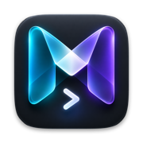
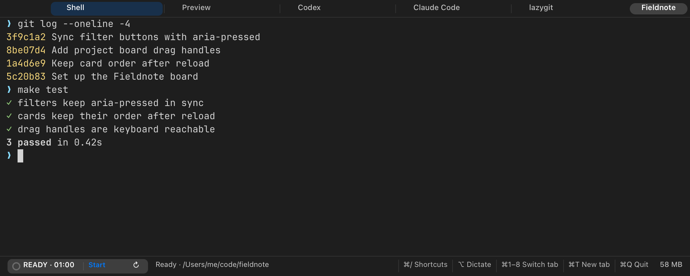
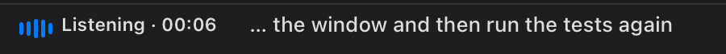

<p align="center">
  
</p>

<h1 align="center">Mica</h1>

<p align="center">
  <strong>Your terminal, voice typing and focus timer in one light Mac app.</strong><br>
  Every project gets its own window, and the whole thing idles around 55–60 MB,<br>
  where a terminal plus a dictation app on the same Mac takes about 770 MB.
</p>

<p align="center">
  <a href="https://github.com/megasoft1978/mica-terminal/releases/latest"></a>
  
  <a href="LICENSE"></a>
</p>

<p align="center">
  <a href="https://megasoft1978.github.io/mica-terminal/">Website</a> ·
  <a href="https://github.com/megasoft1978/mica-terminal/releases/latest/download/Mica.dmg"><strong>Download</strong></a> ·
  <a href="https://github.com/megasoft1978/mica-terminal/releases/latest">Release notes</a> ·
  <a href="LICENSE">MIT license</a>
</p>

<p align="center">
  <picture>
    <source media="(prefers-color-scheme: light)" srcset="docs/assets/mica-light.png">
    
  </picture>
</p>

<p align="center"><sub>The real Mica view, rendered from a sample project.</sub></p>

## Why it is light

Most people run a terminal, a voice-typing app and a timer as separate programs, and the voice app alone is often a web browser in disguise. Mica builds them into one native process with no web view.

| Idle, one window, same Mac | Covers | Memory |
| --- | --- | ---: |
| **Mica** (3 tabs) | terminal, dictation, focus timer | **about 55–60 MB** |
| Alacritty | terminal | 69 MB |
| kitty | terminal | 80 MB |
| iTerm2 | terminal | 126 MB |
| Wispr Flow | dictation | 645 MB |

iTerm2 plus Wispr Flow is about 770 MB before you add a timer. Dictation adds a helper of about 35 MB only while you talk (about 95 MB in total), then it exits. Mica also shows its own memory live, bottom right. Project windows share one process, so extra windows cost about 25 MB each rather than a whole app. Method, caveats and the places Mica does not win (very large windows) are in [docs/MEMORY-BASELINE.md](docs/MEMORY-BASELINE.md).

## What you get

- **A window per project.** Named tabs, folders and configured startup commands reopen after quitting. Project launchers keep their own configured layouts. The Dock icon shows the mark of the project in front. The status bar shows the git branch, and **Session → New Worktree Tab…** gives an agent its own checkout.
- **Agents stay ordinary programs.** Run Codex, Claude Code, `lazygit` or anything else in a normal `zsh` tab. Mica reads the visible screen for signs of work or a question and shows it on the tab, and posts a notification when a program asks for attention.
- **Good dictation that stays on your Mac.** Hold left <kbd>⌥</kbd>, speak, edit the text, press Return. It uses NVIDIA’s Parakeet speech model through Core ML; Mica downloads the 630 MB model in the background on first launch, with progress in the status bar, so dictation is ready when you need it. Nothing you say is sent anywhere.
- **A focus timer that follows you.** One timer shared by every Mica window, with a notification when a period ends.
- **Still a real terminal.** Search scrollback, Command-click links, drag tabs, choose a cursor and a dark, light or system-following theme. If a program over SSH asks to set your clipboard, Mica asks you first.

## Install

1. [Download Mica.dmg](https://github.com/megasoft1978/mica-terminal/releases/latest/download/Mica.dmg) (Apple silicon, macOS 14 or later) and drag Mica to Applications.
2. Mica is signed with a Developer ID and notarized by Apple, so it opens normally. Alpha builds may still change quickly.
3. Mica asks for the microphone only when you start dictation. Checksums are in `SHA256SUMS.txt` on the [release page](https://github.com/megasoft1978/mica-terminal/releases/latest).

### Build from source

You need Xcode’s command line tools (Swift 6). The terminal parsing library is in the repository; the first build also fetches the speech package over the network.

```sh
git clone https://github.com/megasoft1978/mica-terminal.git
cd mica-terminal
make app && open build/Mica.app
```

### Dictation, live

<p align="center"></p>

The microphone starts recording the moment you hold <kbd>⌥</kbd>, so nothing you say is lost while the model loads. The strip shows a live level, the time, and the last few words as they are recognized. If macOS blocks microphone access, choose **Open Microphone Settings** in the strip to enable it.

## Privacy and questions

- **What leaves my Mac?** Nothing you say or type. Recognition runs locally through Core ML. The only network traffic is the one-time 630 MB speech model download; there are no accounts, analytics or telemetry.
- **Microphone permission?** Asked once, when you first dictate. Audio is processed in memory and not saved.
- **Is the download safe?** It is signed with a Developer ID and notarized by Apple. Check it with `shasum -a 256 -c SHA256SUMS.txt` next to the downloaded files.
- **Intel Macs?** Not yet; this alpha is built and tested on Apple silicon.
- **Codex, Claude Code, lazygit?** Ordinary programs in a zsh tab. Mica shows on the tab when an agent is working or waiting for you.

## Keys worth knowing

| | |
| --- | --- |
| Switch tabs | <kbd>⌘1</kbd>–<kbd>⌘9</kbd> |
| New tab, close tab, new window | <kbd>⌘T</kbd> · <kbd>⌘W</kbd> · <kbd>⌘N</kbd> |
| Dictate | hold left <kbd>⌥</kbd> |
| Find, next, previous | <kbd>⌘F</kbd> · <kbd>⌘G</kbd> · <kbd>⇧⌘G</kbd> |
| Text size, reset | <kbd>⌘+</kbd> <kbd>⌘−</kbd> · <kbd>⌘0</kbd> |
| Light or dark theme | <kbd>⌥⌘L</kbd> |
| Clear scrollback | <kbd>⌘K</kbd> |
| All shortcuts | <kbd>⌘/</kbd> |

## Project launchers

Choose **Mica → New Project Launcher…**, or run `make new-instance`. For a script, skip the prompts:

```sh
python3 scripts/install-desktop-apps.py --new-instance \
  --name "My Project" --folder ~/code/my-project --command codex
```

Edit a project’s tabs later with **Project → Project Settings…**. A `.mica` layout file can define named tabs, folders and optional commands.

## Under the hood

A C session core owns the shells and scrollback, a vendored, patched [libvterm](third_party/libvterm) parses escape sequences, and a thin AppKit layer draws everything. Memory and speed notes: [measurements](docs/MEMORY-BASELINE.md), [performance](docs/PERFORMANCE.md).

```sh
make test       # PTY, UI, launcher and fixture checks; never sends prompts to agent CLIs
make sanitize   # session tests and a fuzzer under AddressSanitizer and UBSan
make stress     # thousands of random UI actions under the sanitizers
make validate   # tests, build, helper build and bundle checks
make dmg        # ad-hoc sign, build Mica.dmg, Mica.zip and checksums (SIGN_ID="Developer ID Application: …" to override)
```

More: [what is left](docs/ROADMAP.md) · [how it compares](docs/COMPETITORS.md) · [stability testing](docs/STABILITY.md) · [UI plan](docs/UI-REVIEW.md) · [releasing](docs/RELEASING.md) · [agent notifications](docs/AGENT-NOTIFICATIONS.md) · [contributing](CONTRIBUTING.md) · [security](SECURITY.md)

## Credits

Mica is released under the [MIT License](LICENSE). It uses [libvterm](https://github.com/neovim/libvterm) (MIT), [JetBrains Mono](https://github.com/JetBrains/JetBrainsMono) (SIL OFL 1.1), and for local dictation [FluidAudio](https://github.com/FluidInference/FluidAudio) (Apache-2.0), Apple Core ML, and [Parakeet Ultra by Moondream](https://huggingface.co/moondream/parakeet-ultra), based on NVIDIA Parakeet TDT 0.6B v3 (CC BY 4.0). Full notices: [voice/THIRD_PARTY_NOTICES.md](voice/THIRD_PARTY_NOTICES.md).
