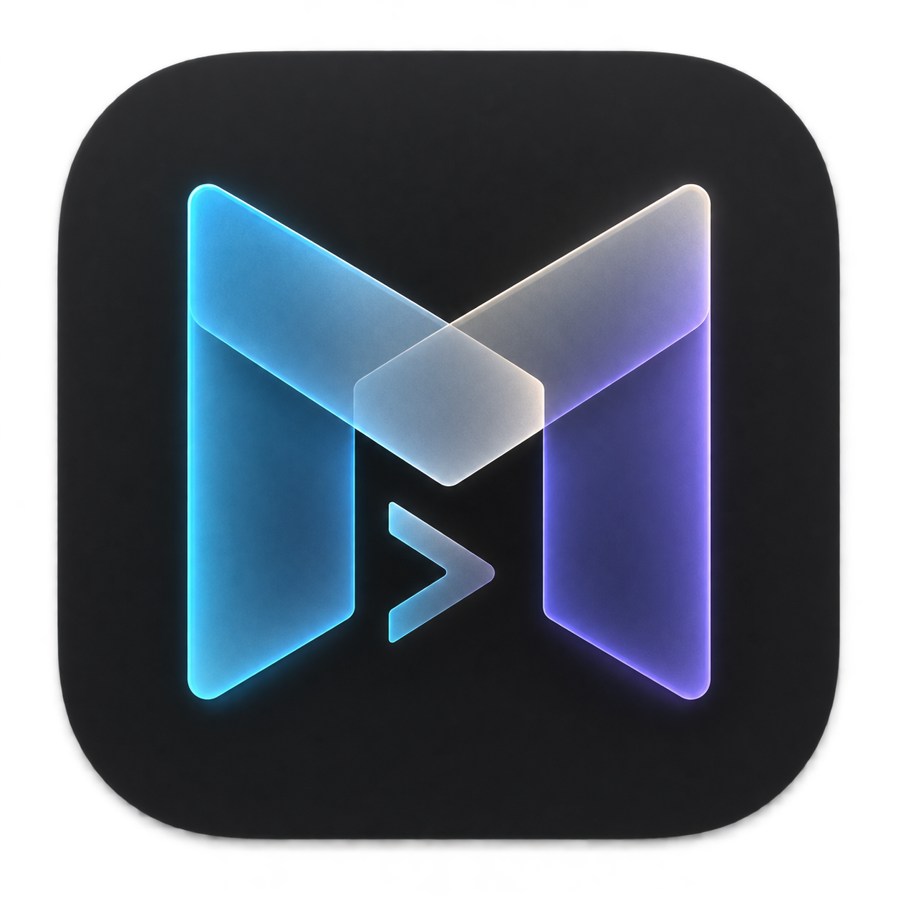

# Mica Terminal

<p align="center">
  
</p>

<p align="center">
  <a href="https://github.com/megasoft1978/mica-terminal/actions/workflows/macos.yml"></a>
</p>

A lightweight, native macOS terminal workspace for shell and coding-agent sessions. Mica's session manager and bounded scrollback are written in C, terminal parsing uses `libvterm`, and a small AppKit frontend draws the interface.

## Features

- Project windows, terminal tabs, and keyboard-driven navigation.
- macOS light/dark appearance, system accent colors, and readable interface text.
- ANSI, 256-color, and truecolor support; Unicode and emoji rendering.
- Scrollback allocated on demand, capped at 2 MiB per session.
- Optional Claude Code and Codex launch and resume shortcuts configured per project.
- Agent completion status with an exit code, tab indicator, and Dock attention for background work.
- `⌘V` text paste and image-paste routing to the foreground CLI.
- Per-project macOS app identities and marked icons for Dock and Spaces.
- Bounded local test-and-repair loop for ongoing development.

## Build

Requires macOS 13 or newer, Xcode Command Line Tools, Homebrew, `libvterm`, and `pkg-config`.

```sh
xcode-select --install # if needed
brew install libvterm pkg-config
make validate
open build/Mica.app
```

Start a terminal in a directory or run a command:

```sh
open build/Mica.app --args --cwd "$PWD"
open build/Mica.app --args --cwd "$PWD" --command "git status"
```

## Controls

| Shortcut | Action |
| --- | --- |
| `⌘T` / `⌘W` | New shell tab / close tab |
| `⌘⇧[` / `⌘⇧]` | Previous / next tab |
| `Ctrl-T` | Tab navigation mode (`h/j/k/l`, arrows, `1`–`9`, `n`, `x`) |
| `Ctrl-S` | Scroll mode; arrows or `j/k` scroll lines, `h/l` or `Ctrl-B/F` scroll pages, `u/d` scroll half pages |
| `Escape` or `Ctrl-C` | Return from scrollback to live output |
| `⌥⌘C` / `⇧⌥⌘C` | Start / resume Claude Code |
| `⌥⌘X` / `⇧⌥⌘X` | Start / resume Codex |
| `⌘C` / `⌘V` | Copy selection / paste text or route an image to the active CLI |
| `⌘+` / `⌘-` | Increase / decrease font size |

Mica sets `TERM=xterm-256color`, `COLORTERM=truecolor`, and `TERM_PROGRAM=Mica`. Image paste forwards `Ctrl-V` to the active CLI, which reads the image from the macOS clipboard. Mica opens zsh by default. Agent shortcuts run only commands configured in that project's local layout; when no command is set, the shortcut opens a zsh tab.

When a configured command finishes, Mica shows its exit status. A background tab gets a marker, and Mica requests Dock attention if the app is unfocused.

## Project apps and layouts

Mica reads project layouts from `~/.config/mica/layouts/`. Each `.mica` file contains tab-separated tab names, working directories, and optional startup commands. Add optional agent commands with these keys:

```text
agent.claude.start<TAB>your command
agent.claude.resume<TAB>your command
agent.codex.start<TAB>your command
agent.codex.resume<TAB>your command
```

Replace `<TAB>` with a tab character; Mica keeps the rest of the line as the shell command. These files stay in your user configuration and are ignored by Git. Commands run in the project directory through a login zsh.

`make desktop-apps` previews matching Desktop project launchers. `make install-desktop-apps` installs one Mica app per project, gives each app its own bundle identity and colored initials icon, and routes its launcher script to the right layout. Original launchers and scripts are backed up under `~/.local/share/mica/launcher-backups/`. Project apps share one executable file when they are on the same volume; each running app still uses its own process memory.

## Memory and testing

Run `make memory` to sample live RSS and macOS physical footprint. Compare the same projects, tabs, and agent workloads; summed RSS can count shared pages more than once. The current samples are not a controlled before/after benchmark, so no memory-savings percentage is claimed. See [`docs/MEMORY-BASELINE.md`](docs/MEMORY-BASELINE.md).

Run `make test` for PTY, terminal rendering, clipboard, layout, app identity, icon, completion, and agent-loop tests. `make validate` also builds the app and checks its property list. The automated agent tests use local stubs and do not contact Claude or Codex.

Before the final interactive check, run `make preflight`. It repeats the full build and test validation. To check installed command line tools in the login shell without starting a session, pass their executable names, for example `scripts/check-agent-clis.sh claude codex`.

For bounded automated repair passes, run:

```sh
scripts/agent-loop.sh 3
```

This uses the local Codex CLI with `gpt-6-luna` by default (`MICA_AGENT_MODEL` overrides it). It requires an authenticated CLI session, can edit the checkout, and does not commit or push changes.

## Notes

- See [`docs/AGENT-NOTIFICATIONS.md`](docs/AGENT-NOTIFICATIONS.md) for optional agent notifications.
- See [`AGENT_LOOP.md`](AGENT_LOOP.md) for the automated iteration instructions.
